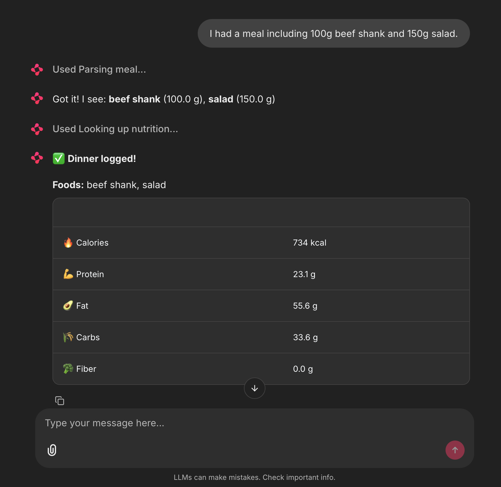
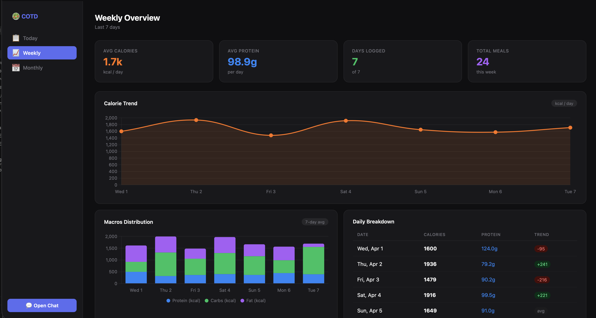

<div align="center">

# COTD — Calories of the Day

**A local-first, AI-powered calorie tracker that runs entirely on your machine.**  
Chat naturally about what you ate. The agent asks follow-up questions, looks up real nutrition data, and logs everything to a local database — no cloud, no subscriptions.

<br/>

[](https://python.org)
[](https://chainlit.io)
[](https://ollama.com)
[](https://fdc.nal.usda.gov)
[](LICENSE)

</div>

---

## What is COTD?

COTD is a **multi-agent calorie tracking system** built on local LLMs via [Ollama](https://ollama.com). Instead of manually entering foods into a form, you just describe what you ate in plain language — or Chinese, or any language — and the agent handles the rest.

```
You:   "I had pasta and tomato sauce for dinner"
Agent: "How much pasta did you have? (e.g. 1 cup, 200g, 1 plate)"
You:   "About 2 cups"
Agent: ✅ Dinner logged! — 480 kcal | 18g protein | 92g carbs | 4g fat
```

The system asks clarifying questions until it has enough information, then looks up real USDA nutrition data and saves everything locally to SQLite.

---

## Features

| | |
|---|---|
| 🧠 **Multi-agent pipeline** | Router → Text Parser → Reasoning → Nutrition Lookup → Database |
| 💬 **Persistent chat memory** | Same meal context retained across messages — no context loss |
| 🌍 **Multilingual input** | Chinese, English, and more — all normalized to English food names |
| 🔍 **USDA FoodData Central** | Real nutrition data with smart result ranking |
| 📊 **Analytics dashboard** | Daily, weekly, and monthly views with interactive charts |
| 🗂️ **Edit & delete meals** | Fix any logged meal directly from the dashboard |
| 💾 **100% local** | SQLite database, local LLMs, no data leaves your machine |
| 📓 **Jupyter notebook** | Full prototype with step-by-step cells and tests |

---

## Architecture

```
User message
     │
     ▼
┌─────────────┐     text      ┌─────────────┐
│   Router    │──────────────▶│  Text Agent │  qwen2.5:3b-instruct
│  gemma3:1b  │               └──────┬──────┘
└─────────────┘                      │ ingredients[]
                                     ▼
                            ┌─────────────────┐
                            │ Reasoning Agent │  deepseek-r1:1.5b
                            │ completeness?   │
                            └────────┬────────┘
                         score≥0.75  │ <0.75 → ask user
                                     ▼
                            ┌─────────────────┐
                            │ Nutrition Lookup│  USDA FDC API
                            │ cache → USDA   │  + SQLite cache
                            │ → fallback      │
                            └────────┬────────┘
                                     ▼
                            ┌─────────────────┐
                            │  Database Agent │  SQLite (cotd.db)
                            └─────────────────┘
```

**Models used:**

| Role | Model | Why |
|---|---|---|
| Router | `gemma3:1b` | Fast binary classification |
| Text parser | `qwen2.5:3b-instruct` | Strong multilingual + instruction following |
| Reasoning | `deepseek-r1:1.5b` | Chain-of-thought completeness scoring |

---

## Screenshots

> **Chat interface** — Ask the agent what you ate. It follows up until it has enough info.



> **Dashboard — Weekly/Monthly Logs** — Macro breakdown, meal distribution, and edit/delete per entry.




---

## Getting Started

### Prerequisites

- [Ollama](https://ollama.com) running locally
- Python 3.11+ with conda or venv
- Free [USDA FDC API key](https://fdc.nal.usda.gov/api-key-signup.html)

### 1. Pull the models

```bash
ollama pull gemma3:1b
ollama pull qwen2.5:3b-instruct
ollama pull deepseek-r1:1.5b
```

### 2. Install dependencies

```bash
pip install chainlit fastapi uvicorn httpx requests python-dotenv pydantic
```

### 3. Set your API key

Create a `.env` file in the project root:

```bash
USDA_API_KEY=your_key_here
```

> The USDA key is free and has a 3,600 req/hour limit. Without it, the system falls back to generic nutrition estimates.

### 4. Run

**Terminal 1 — Chat interface:**
```bash
chainlit run chainlit_app.py --port 8000
```

**Terminal 2 — Analytics dashboard:**
```bash
python api_server.py
```

| Service | URL |
|---|---|
| Chat | http://localhost:8000 |
| Dashboard | http://localhost:8001 |

---

## Usage

### Logging a meal

Just describe it naturally:

```
"I had 145g grilled chicken, 90g steamed broccoli, and 1 tsp olive oil"
"一碗青椒炒肉丝" (Chinese input works too)
"Smoothie: banana, 1 cup greek yogurt, 1 tbsp honey"
```

The agent will ask follow-up questions if amounts are missing, then log the meal.

### Chat commands

| Command | Action |
|---|---|
| `last meal` | Recall the previous meal logged this session |
| `today summary` | Show today's macro totals |
| `skip` | Use default amounts (100g) for missing ingredients |

### Dashboard

- **Today's Log** — view, edit, or delete any meal
- **Weekly** — 7-day trend line + stacked macro bars + daily table
- **Monthly** — 30-day area chart + weekly totals + highlights

---

## Project Structure

```
COTD/
├── agents.py           # All agent logic (single source of truth)
├── chainlit_app.py     # Chainlit chat UI
├── api_server.py       # FastAPI REST API for the dashboard
├── dashboard.html      # Analytics dashboard (vanilla JS + Chart.js)
├── COTD_PrototypeI.ipynb  # Jupyter notebook prototype with tests
├── .env                # API keys (git-ignored)
├── cotd.db             # SQLite database (git-ignored)
└── calorie_agent_spec.md  # Full system specification
```

---

## Database Schema

```sql
meals              -- one row per logged meal
meal_ingredients   -- one row per ingredient in each meal
ingredient_cache   -- USDA results cached by ingredient name
```

All data is stored locally in `cotd.db`. Nothing is sent to any external service except the USDA FoodData Central API for nutrition lookup.

---

## Roadmap

- [ ] Image input (describe food from a photo)
- [ ] Daily calorie goals + progress indicators
- [ ] Export to CSV / JSON
- [ ] Meal templates for frequent foods
- [ ] Mobile-friendly dashboard

---

## License

MIT © [AndyGongDS](https://github.com/AndyGongDS)

---

<div align="center">
<sub>Built with Ollama · Chainlit · USDA FoodData Central · SQLite</sub>
</div>
